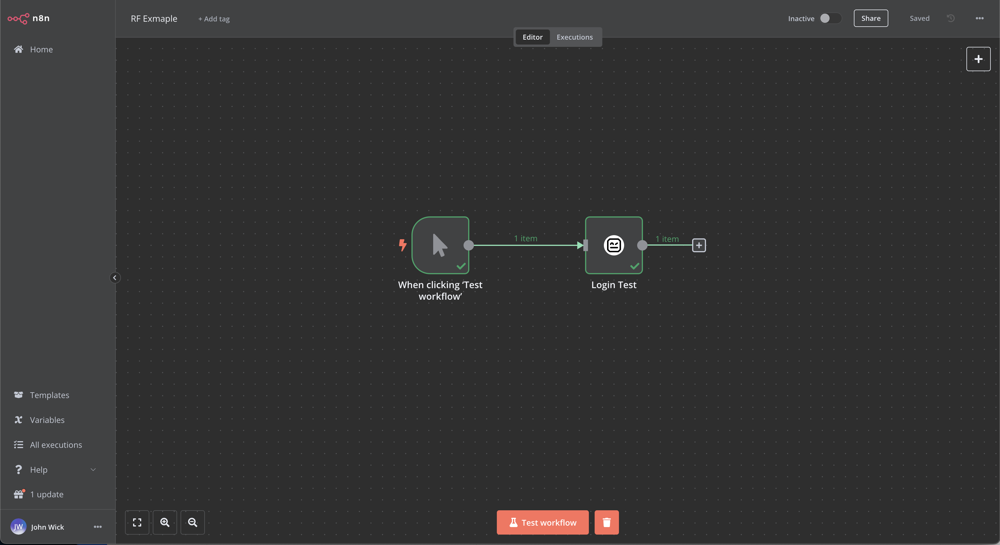
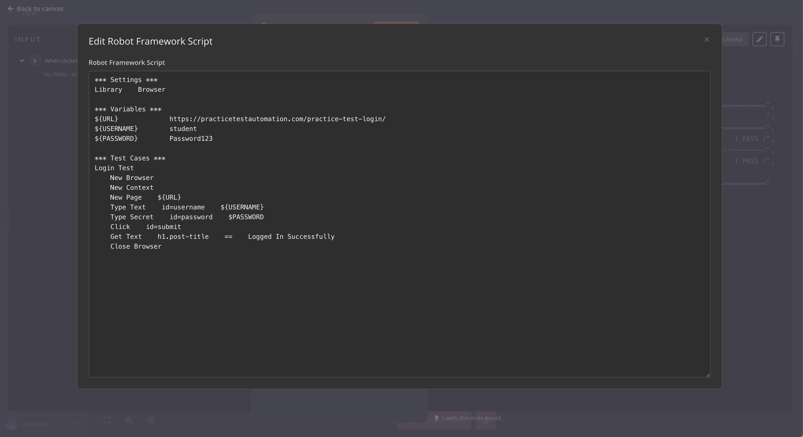
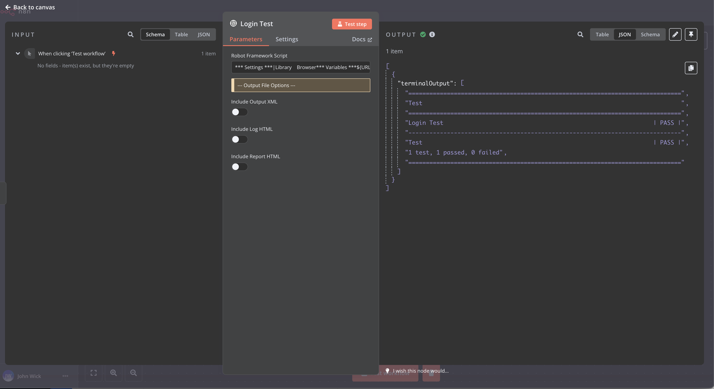

# n8n-nodes-robotframework

This is an n8n community node that lets you execute [Robot Framework](https://robotframework.org/) scripts in your n8n workflows, enabling test automation, web automation, and task automation directly within n8n.

[Robot Framework](https://robotframework.org/) is an open-source automation framework used for acceptance testing, robotic process automation (RPA), and more. This node provides the flexibility to execute .robot scripts and utilize Robot Framework libraries and keywords for advanced automation scenarios.

[n8n](https://n8n.io/) is a [fair-code licensed](https://docs.n8n.io/reference/license/) workflow automation platform.

[Installation](#installation)  
[Operations](#operations)  
[Compatibility](#compatibility)  
[Usage](#usage)  
[Resources](#resources)  
[Version history](#version-history)  

## Installation

Follow the [installation guide](https://docs.n8n.io/integrations/community-nodes/installation/) in the n8n community nodes documentation.

## Operations

- **Execute Robot Framework Script**: Runs a Robot Framework script within an n8n workflow. You can define variables, settings, test cases, and custom keywords.
- **Optional Output Attachments**: Includes options to generate and attach output files (output.xml, log.html, report.html) to your workflow for test results and logs.

## Compatibility

This node is compatible with n8n versions that support custom nodes. It requires Robot Framework to be installed on the system and accessible to n8n.

## Usage

This node is suitable for advanced users familiar with Robot Framework syntax and its capabilities. Define your Robot Framework script directly within the node’s configuration, including sections like Settings, Variables, Test Cases, and Keywords.

**Example Usage**:

This node also provides options to include output files (`output.xml`, `log.html`, and `report.html`) for deeper insights into test results:

## Resources

- [n8n community nodes documentation](https://docs.n8n.io/integrations/community-nodes/)
- [Robot Framework documentation](https://robotframework.org/)

## Version history

- **0.0.1** - Initial release with support for script execution and output file generation.
- **0.0.2** - Enhanced terminal output readability for Robot Framework test results, preserving original spacing for better clarity in n8n json view.
- **0.0.3** - Refactored error handling and variable output:
  - Replaced console output with variable-based results for better clarity.
  - Improved error handling to display stderr messages during failures.
  - Centralized variable logging for improved maintainability and debugging.
  - Optimized code structure for test execution and error management.
- **0.0.4** - Refactored code for modularity and readability:
  - Extracted helper functions: prepareExecutionPaths, runRobotTests, generateOutputJson, extractVariablesFromOutput, and collectAttachments.
  - Simplified handling of terminal output and error reporting.
  - Improved variable extraction logic.
- **0.0.5**
  - Fixed error handling
  - Add default Robot Framework structure to node
  - Refactoring