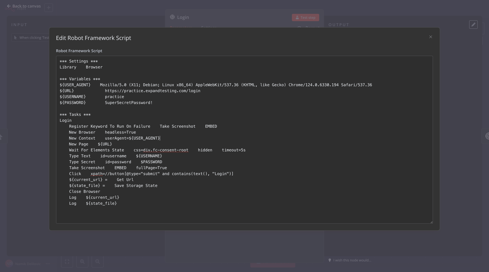
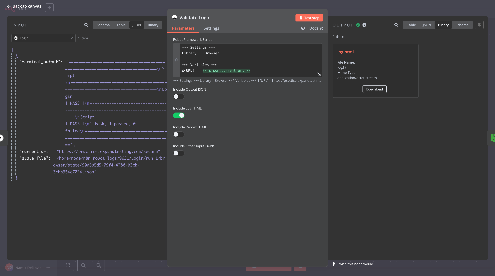
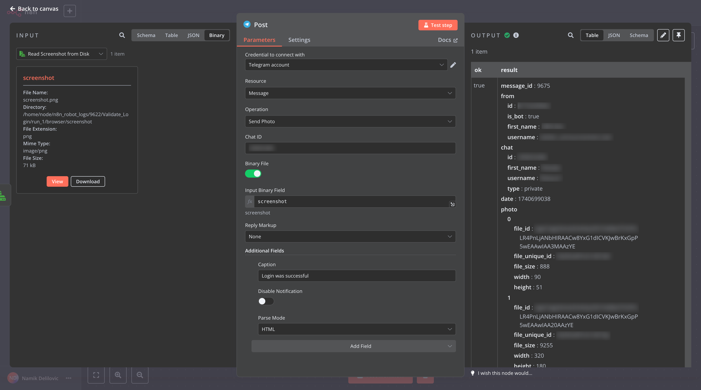

# n8n-nodes-robotframework

This is an n8n community node that enables you to execute [Robot Framework](https://robotframework.org/) scripts directly within your n8n workflows, combining the power of low-code automation with advanced test and robotic process automation (RPA).

[n8n](https://n8n.io/) is a low-code workflow automation tool similar to Zapier and Make, designed to automate complex workflows with ease. [Robot Framework](https://robotframework.org/) is a versatile automation framework widely used for robotic process automation (RPA), acceptance testing, and more. This node bridges the two systems, allowing seamless execution of Robot Framework scripts inside n8n workflows.

One of the most exciting use cases of this integration is with the [Robot Framework Browser library](https://robotframework-browser.org/), which supports UI-based interactions like user clicks and website automation without requiring a GUI system environment — everything runs smoothly inside a Docker container housing both n8n and the Robot Framework node.


## Installation

This guide walks you through setting up the Robot Framework Node in `n8n` and running `n8n` locally using a Docker container. You can follow either the **Quick Start** or **Detailed Instructions**, based on your preference.

### Quick Navigation
- [Quick Start](#quick-start)
- [Detailed Instructions](#detailed-instructions)
- [Installing Community Node](#installing-community-node)

---

### Quick Start

To quickly set up, ensure **Docker** is installed, then run the following command:

```bash
docker run -it --rm --name n8n -p 5678:5678 -v n8n_data:/home/node/.n8n delilovic/n8n_robotframework:latest
```

Once the container is up and running, you will see the following message in the terminal:

```bash
Editor is now accessible via:
http://localhost:5678/
```

Open this URL in your browser to start using `n8n`. Next, follow the [Installing Community Node](#installing-community-node) section to add the Robot Framework Node.

---

### Detailed Instructions

#### Using the Default `n8n` Docker Image
The default Docker image for `n8n` is based on **Alpine Linux**. To set it up, you can refer to the official installation guide:  
[Official n8n Docker Installation Guide](https://docs.n8n.io/hosting/installation/docker/).  

#### Using the Custom `n8n_robotframework` Docker Image
If you are using the **Robot Framework Browser Library**, you'll need the custom image `n8n_robotframework`, based on **Debian Bullseye**, because the Browser Library (which uses Playwright) is not compatible with Alpine Linux.

1. Replace the default image in your setup:
   ```bash
   docker.n8n.io/n8nio/n8n
   ```
   with:
   ```bash
   delilovic/n8n_robotframework:latest
   ```

2. To run the custom Docker container, execute:
   ```bash
   docker run -it --rm --name n8n2 -p 5678:5678 -v n8n_data:/home/node/.n8n delilovic/n8n_robotframework:latest
   ```

Once the container is up and running, you will see the following message in the terminal:

```bash
Editor is now accessible via:
http://localhost:5678/
```

Open this URL in your browser to start using `n8n`. Then proceed to the next step, [Installing Community Node](#installing-community-node), to add the Robot Framework Node.

---

### Installing Community Node

After setting up `n8n` (via either Quick Start or Detailed Instructions), follow these steps:

1. **Access Settings**:
   - Navigate to **n8n settings** in your instance.

2. **Open Community Node Section**:
   - Go to **Community Nodes**.

3. **Install Robot Framework Node**:
   - Click the **Install** button and enter:

     ```plaintext
     n8n-nodes-robotframework
     ```

   - Confirm the installation.

4. **Refresh the Page**:
   - Refresh your browser window to apply the changes.

5. **Start Using the Node**:
   - The **Robot Framework Node** will now be available in your `n8n` workflow editor.

---

### About the Custom `n8n_robotframework` Image

The custom Docker image, **`n8n_robotframework`**, is regularly updated alongside major versions of `n8n` (e.g., 1.72.0, 1.73.0, etc.). It is specifically designed to support the Robot Framework and its Browser Library while requiring minimal changes to the original image.

Additionally, the Robot Framework and the Browser Library are automatically updated to their latest versions every time the build runs for new `n8n` major versions.

You can access its source code or contribute at this GitHub repository:  
[GitHub Repository - Custom n8n Robot Framework Image](https://github.com/Delilovic/n8n-debian/tree/master/docker/images)

## Usage Example

In this example, we will demonstrate the capabilities of *n8n* and *Robot Framework* with a simple yet powerful use case: performing a user login on a website and validating that the user is logged in successfully.

The example highlights the ability to interact with websites, capture screenshots, and maintain browser context while executing workflows across multiple nodes. Each node represents a separate execution.

Additionally, we will showcase how to export the Robot Framework's report files and pass variables between nodes seamlessly.

### Overview


The workflow shown in the image consists of four nodes: a trigger node, two Robot Framework nodes, and a Telegram node. The trigger node starts the workflow when the “Test workflow” button is clicked. The first Robot Framework node handles the login process, while the second validates that the login was successful. Finally, the Telegram node sends a notification confirming the successful login and provides the URL of the website.

### Login Node Details


When we open the Login node, we see the Robot Framework script area, where the code for automating the login process is written. In this example, we have selected the Include Log HTML option to ensure an execution report (log.html) is generated after the script runs.

As the node has already been executed, the log.html file is now available for download on the Output panel, providing a detailed log of the execution.

There is also an option to toggle Include Other Input Fields, which would pass variables from the previous node to the script. However, since the previous node is a trigger node without any relevant data to pass, this option has been left disabled.



The Login Node contains classic Robot Framework code with its standard structure, which includes Settings, Variables, and Tasks (with support for Keywords and Tests as well). In this example, the Browser Library is used to perform the following actions:
* Open a new browser instance and context.
* Navigate to the login page using the URL defined in the variables section.
* Enter the username and password into the respective fields.
* Click the login button to authenticate.

Additionally, we save the current URL `${current_url}` and browser state `${state_file}` to maintain session continuity. This allows the Validate Login node to pick up exactly where the Login Node left off without requiring reauthentication.

A screenshot is also captured during the login process, which will be included in the log.html report file for easier debugging or verification.

All variables defined in the Variables section and initialized in the Tasks section are automatically forwarded to the next node. Along with the Robot Framework’s standard test result output, this allows flexibility to reuse values, such as the session state and current URL, in subsequent nodes.


The log.html report file displays the standard Robot Framework execution report. It includes details such as the execution status (PASS), the steps performed (e.g., opening a new browser, navigating to the URL, and entering credentials), and the time taken for each step.

Additionally, as defined in the code, the report includes the screenshot taken just before pressing the login button. This provides a visual confirmation of the login page and the filled-in credentials at the time of execution, making it easier to verify and debug the automation process.

### Validate Node Details



In the Validate Login node, the input panel on the left shows the variables and values passed from the previous Login node, including the browser context `state_file` and the URL `current_url`. These are essential for this step as they allow the node to continue the session established during the login process without requiring reauthentication.

The Robot Framework script for validation is defined in the edit field, where it utilizes the passed browser context and URL to verify that the login was successful. We have enabled Log HTML generation to include a detailed execution report.

For demonstration purposes, the Include Other Input Fields option is enabled to show how this toggle can be used to forward all variables and values to the next node. This ensures that the Telegram node can access the `current_url` and include it in the notification message sent after the validation step.


In the Validate Login node, we use the Expression View, which allows us to dynamically reference JavaScript expressions and variables from the previous node. Instead of hardcoding values, we use variables like `{{ $json.current_url }}` and `{{ $json.state_file }}`. On the right, we can see how these expressions are evaluated since the node has already been executed and the variables and their values are now known to the editor.

This code reuses the browser context `state_file` from the previous node, enabling the browser to continue exactly where it left off. The code navigates to the saved URL and checks for the presence of a specific label ("Secure Area page for Automation Testing Practice") that is only visible after a successful login. To ensure accuracy and provide visual confirmation, the workflow also captures a screenshot, which will appear in the log.html file.

By combining variables from the previous node and runtime evaluations, this approach makes the workflow more flexible and adaptable to different inputs and scenarios.


The log.html report generated from the Validate Login node confirms the successful execution of the validation step. The captured screenshot is included, showing the Secure Area page for Automation Testing Practice, which verifies that the login was successful.

### Telegram Node Integration



Finally, the Telegram node demonstrates how seamlessly Robot Framework can integrate with other n8n nodes, such as AWS, OpenAI, Airtable, and many more.

In this example, the URL passed from the Validate Login node is dynamically inserted into the Telegram message using an expression `{{ $json.URL }}`. The message is then sent to a Telegram channel along with the text: “Login was successful!”.

This setup highlights how easily you can combine Robot Framework automation with powerful integrations in n8n to create end-to-end workflows that involve notifications, external APIs, and more. The output panel confirms the successful delivery of the message to the Telegram channel, completing the workflow.

### Importing This Example into Your n8n Instance  

You can easily import this example into your n8n instance by following these steps:  

1. Create an empty workflow in your n8n instance.  
2. Open the workflow editor and click on the three dots `...` at the top right.  
3. Select **Import from File** from the dropdown menu.  
4. Upload the [Robot_Framework_Example.json](examples/Robot_Framework_Example.json) file, which you can download from the repository.  

This will load the entire example workflow into your instance, allowing you to explore and customize it as needed.  

Note: If you prefer not to create a Telegram API token or account, you can simply remove the Telegram node. Everything else will function as expected.

## Version history

- **0.0.1** - Initial release with support for script execution and output file generation.
- **0.0.2** - Enhanced terminal output readability for Robot Framework test results, preserving original spacing for better clarity in n8n json view.
- **0.0.3** - Refactored error handling and variable output:
  - Replaced console output with variable-based results for better clarity.
  - Improved error handling to display stderr messages during failures.
  - Centralized variable logging for improved maintainability and debugging.
  - Optimized code structure for test execution and error management.
- **0.0.4** - Refactored code for modularity and readability:
  - Extracted helper functions: prepareExecutionPaths, runRobotTests, generateOutputJson, extractVariablesFromOutput, and collectAttachments.
  - Simplified handling of terminal output and error reporting.
  - Improved variable extraction logic.
- **0.0.5**
  - Fixed error handling
  - Add default Robot Framework structure to node
  - Refactoring
- **0.0.6**
  - Updated the README file with the latest changes.
  - Applied those changes to the npm website.